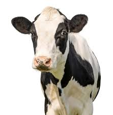
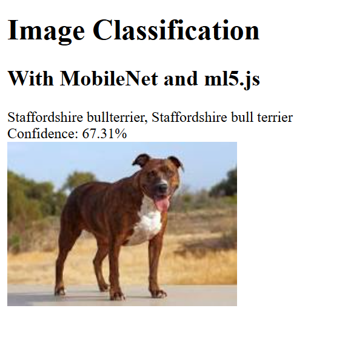
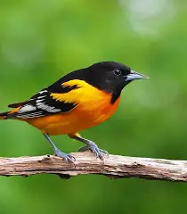
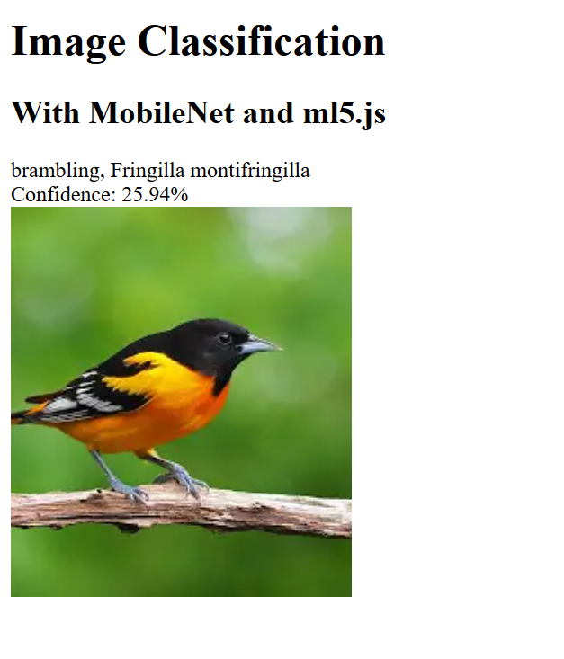

# Image Classification

This project performs image classification using machine learning techniques.

## Features
- Classifies images into predefined categories
- Simple UI built with HTML/CSS/JavaScript

## Usage
1. Upload your image
2. The model will predict its category

## Author
Yussif Mutawakil

 

 

 

 

